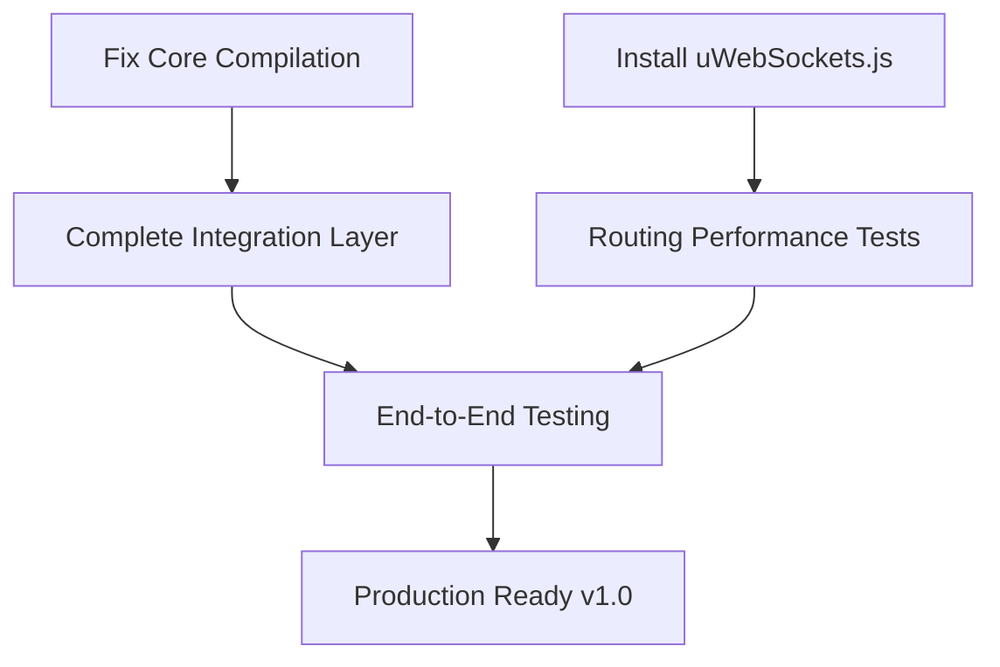

# 🎯 Current Issues & Immediate Actions

## 🚨 Critical Issues (Action Required)

### 1. Core Package Compilation Errors
**Status**: 🔴 Blocking  
**Priority**: P0 (Critical)  
**Affected**: `packages/core/`

**Problem**: 40 TypeScript compilation errors preventing package build
```bash
# Current error count
cd packages/core && npm run build
# Error: Cannot resolve module '../types' (and similar import path issues)
```

**Root Cause**: Import path restructuring during monorepo conversion
- Relative imports pointing to moved/renamed files
- Missing barrel exports in index files
- Type definition mismatches

**Immediate Action Plan**:
1. **Map all broken imports** (estimate: 2 hours)
   ```bash
   # Find all import statements needing fixes
   grep -r "import.*from '\.\." packages/core/src/
   ```

2. **Fix import paths systematically** (estimate: 4 hours)
   - Update relative paths to match new structure
   - Add missing barrel exports to index files
   - Resolve circular dependency warnings

3. **Verify type definitions** (estimate: 1 hour)
   - Ensure all exported types are properly defined
   - Fix any interface/type mismatches

**Expected Outcome**: 0 compilation errors, successful `npm run build`

---

### 2. uWebSockets.js Installation Failure
**Status**: 🔴 Blocking  
**Priority**: P0 (Critical)  
**Affected**: `packages/routing/`

**Problem**: Cannot install uWebSockets.js from GitHub
```bash
# Failed installation attempts
npm install uws@github:uNetworking/uWebSockets.js
# Error: Unable to resolve GitHub reference
```

**Root Cause**: GitHub access issues or repository reference problems

**Immediate Action Plan**:
1. **Try alternative installation methods** (estimate: 1 hour)
   ```bash
   # Direct GitHub URL
   npm install https://github.com/uNetworking/uWebSockets.js.git
   
   # Specific branch/tag
   npm install uws@github:uNetworking/uWebSockets.js#v20.44.0
   
   # Build from source
   git clone https://github.com/uNetworking/uWebSockets.js.git
   cd uWebSockets.js && npm install && npm run build
   ```

2. **Configure as optional dependency** (estimate: 30 minutes)
   - Move to optionalDependencies in package.json
   - Add runtime checks for uWS availability
   - Provide fallback implementation

3. **Test integration** (estimate: 1 hour)
   - Verify uWS bindings work correctly
   - Test HTTP server functionality
   - Validate performance benchmarks

**Expected Outcome**: Successful uWebSockets.js integration or graceful fallback

---

## ⚠️ High Priority Issues

### 3. Missing Integration Layer
**Status**: 🟡 In Progress  
**Priority**: P1 (High)  
**Affected**: `packages/hyper-decor/`

**Problem**: Main package lacks application factory and integration
```typescript
// Missing: Core application class
export class HyperApplication {
  // Need: Decorator registration
  // Need: Router integration  
  // Need: Lifecycle management
}

// Missing: Easy-to-use factory
export function createApp(options?: AppOptions): HyperApplication {
  // Implementation needed
}
```

**Immediate Action Plan**:
1. **Create HyperApplication class** (estimate: 3 hours)
2. **Implement createApp factory** (estimate: 1 hour)
3. **Add decorator-router bridge** (estimate: 2 hours)

---

### 4. Test Suite Completion
**Status**: 🟡 Incomplete  
**Priority**: P1 (High)  
**Affected**: All packages

**Problem**: Test coverage below 50% across packages
- Core package: ~30% coverage
- Routing package: ~20% coverage  
- Main package: 0% coverage

**Immediate Action Plan**:
1. **Core package tests** (estimate: 6 hours)
   - Decorator functionality tests
   - Exception handling tests
   - Metadata system tests

2. **Routing package tests** (estimate: 4 hours)
   - Route matching tests
   - Performance benchmarks
   - uWS integration tests

3. **Integration tests** (estimate: 3 hours)
   - Cross-package functionality
   - End-to-end scenarios

---

## 🔧 Medium Priority Tasks

### 5. Documentation Gaps
**Status**: 🟡 Partial  
**Priority**: P2 (Medium)

**Missing Documentation**:
- [ ] API reference for core decorators
- [ ] Routing performance guide
- [ ] Integration examples
- [ ] Migration guide from other frameworks

**Action Plan** (estimate: 8 hours total):
1. Generate API docs from JSDoc comments
2. Create performance benchmarking guide
3. Write comprehensive examples
4. Document best practices

### 6. Build System Optimization
**Status**: 🟡 Working but slow  
**Priority**: P2 (Medium)

**Issues**:
- Full monorepo rebuild takes >10 seconds
- Watch mode not optimized
- Incremental builds not configured

**Action Plan** (estimate: 4 hours):
1. Configure TypeScript project references properly
2. Optimize build scripts for parallel execution
3. Set up incremental compilation
4. Add build caching

---

## 📊 Progress Tracking

### Completion Status Overview
```
Overall Progress: 68% ██████████░░░░░

├── Core Package:     85% ████████████░░░ (blocked by compilation)
├── Routing Package:  70% ██████████░░░░░ (blocked by uWS)
├── Main Package:     60% ████████░░░░░░░ (awaiting integration)
└── Tooling:          40% ██████░░░░░░░░░ (docs, tests, build)
```

### Critical Path Dependencies


### Time Estimates for Critical Path
| Task | Estimate | Dependencies |
|------|----------|--------------|
| Fix core compilation errors | 6 hours | None |
| Install uWebSockets.js | 2 hours | None |
| Complete integration layer | 4 hours | Core compilation |
| Add comprehensive tests | 8 hours | Integration layer |
| **Total to v1.0** | **20 hours** | Sequential execution |

---

## 🚀 Immediate Next Steps (Next 2-4 Hours)

### Step 1: Core Compilation Fix (Priority 1)
```bash
# Start here - highest impact
cd packages/core
npm run build 2>&1 | tee build-errors.log

# Analyze error patterns
grep -E "(Cannot resolve|Module not found)" build-errors.log

# Fix systematically by file
```

### Step 2: uWebSockets.js Resolution (Priority 2)  
```bash
# Parallel task - can work on while core builds
cd packages/routing

# Try multiple installation approaches
npm install https://github.com/uNetworking/uWebSockets.js.git
# OR configure as optional dependency
```

### Step 3: Integration Foundation (Priority 3)
```bash
# After core compilation fixed
cd packages/hyper-decor

# Create basic application class
# Implement createApp factory
# Test core + routing integration
```

---

## 📞 Need Help?

### If You're Stuck
1. **Check `.ai-context/` directories** for package-specific guidance
2. **Review existing code patterns** in working files
3. **Run targeted builds** to isolate issues
4. **Use TypeScript compiler with `--listFiles`** to debug imports

### Debugging Commands
```bash
# Core package detailed errors
cd packages/core && npx tsc --noEmit --listFiles

# Check all import statements
find packages/ -name "*.ts" -exec grep -l "import.*'\.\." {} \;

# Verify package structure
npm run build --workspaces --if-present

# Test specific functionality
npm test -- --testPathPattern=decorators
```

### Success Indicators
- [ ] `npm run build` succeeds in all packages
- [ ] `npm test` passes with >80% coverage
- [ ] `npm run dev` starts successfully
- [ ] Basic HTTP server example works

**Target**: All critical issues resolved within 8-10 hours of focused development.