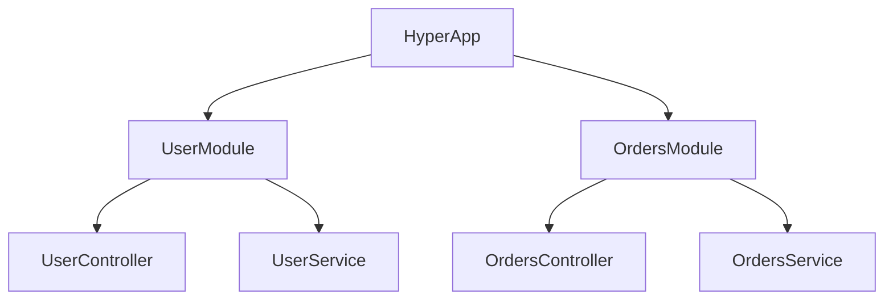

# Hyper-Decor Architecture

`hyper-decor` is designed around a hierarchical component tree that enables deep dependency injection, reactive messaging, and automatic documentation.

## 1. The Component Tree

Everything starts with a `@HyperApp`. The application is composed of **Modules**, which contain **Controllers** and **Services**.



### Lifecycle Hooks
Each component can implement the `OnInit` interface. `hyper-decor` ensures that:
- Dependencies are resolved first.
- `onInit` is called exactly once.
- Sub-components (Modules/Controllers) are prepared only after their parent is ready.

## 2. Automatic OpenAPI Generation

Because `hyper-decor` uses decorators and Zod schemas, it can inspect your controllers at runtime and generate a complete OpenAPI 3.0 specification.

- **Paths**: Derived from `@Get`, `@Post`, etc.
- **Parameters**: Extracted from `@Param`, `@Query`, `@Body`.
- **Validation**: Zod schemas are automatically converted to JSON Schema for the documentation.
- **Namespaces**: Grouped by modules and controllers.

```typescript
@HyperApp({
  openapi: {
    enabled: true,
    path: "/docs/openapi.json",
    info: { title: "My API", version: "1.0.0" }
  }
})
```

## 3. Web Layer Ergonomics

One of the most powerful features of `hyper-decor` is how it handles HTTP responses.

### Automatic Returns
You don't need to manually call `res.send()` or `res.json()`. If you return a value from your controller method, the system will handle it:

```typescript
@Get("/users/:id")
async getUser(@Param("id") id: string) {
  // If we return an object, it's sent as JSON automatically
  return await this.userService.findById(id);
}
```

### Smart Detection
If you manually send a response (e.g., for custom headers or streaming), the system detects it and skips the automatic return:

```typescript
@Get("/custom")
async manual(@Res() res: Response) {
  res.status(201).send("Created Manually");
  return { this: "will be ignored" };
}
```

## 4. Distributed Concurrency (NatsMQ)

NatsMQ is the distributed heart of the system. It uses a **Contract-First** approach to messaging.

### Concurrency Enforcement
The `@MaxAckPendingPerSubject` decorator is essential for preventing service overload in a cluster. It ensures that no matter how many replicas of your service are running, only a fixed number of tasks for a specific subject are processed simultaneously.

```typescript
@OnNatsMessage(Orders.Created)
@MaxAckPendingPerSubject("orders.>", 20) // Cluster-wide limit
async handle(order: Order) { ... }
```
